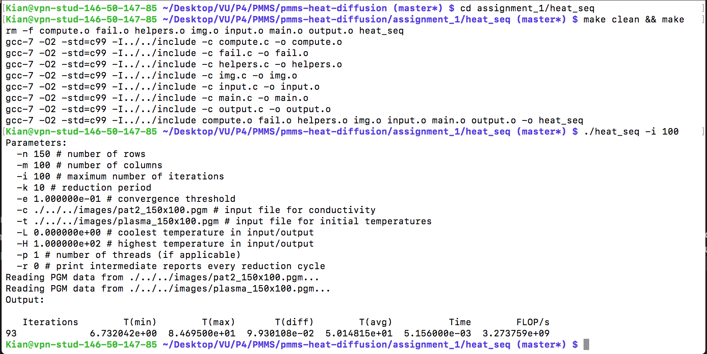

# Programming Multi-core and Many-core Systems (PMMS)
The assignments in this repository were conducted in the course *Programming Multi-core and Many-core Systems* lectured by dr. Clemens Grelck at Universiteit van Amsterdam in Period 4 of the academic year 2017/2018.

The focus of the course was to obtain in-depth knowledge of different levels, technologies and tools for parallelization. The source files of the assignments are made open-source since we believe that they can be seen as a useful source of **parallel programming tutorial**. Aside from the source codes, the report of each assignment is also made available. Reading them is highly recommended to gain a better understanding of the focus of that assignment. 

## How to Run 
All assignments are compiled base on the [Make Build System](https://www.gnu.org/software/make/). Simply running the command `make` in each assignment folder (or the root folder of the assignment number, `assignment_x`) where a `Makefile` is available will be enough to make the binary file of each code. The main algorithm is encapsulated in the `compute.c`. The rest of the tasks, such as IO operation, are isolated in the `src` folder. All assignments, aside from a side exercise, will include an implementation of the heat dissipation problem. The runtime parameters of this task is as follows: 

```
-n 150 # number of rows
-m 100 # number of columns
-i 42 # maximum number of iterations
-k 10 # reduction period
-e 1.000000e-01 # convergence threshold
-c ./../../images/pat2_150x100.pgm # input file for conductivity
-t ./../../images/plasma_150x100.pgm # input file for initial temperatures
-L 0.000000e+00 # coolest temperature in input/output
-H 1.000000e+02 # highest temperature in input/output
-p 1 # number of threads (if applicable)
-r 0 # print intermediate reports every reduction cycle
```

Change the parameters at runtime accordingly if you want to modify any of them (e.g. increase the maximum number of iterations). The input files must follow the [PGM](http://netpbm.sourceforge.net/doc/pgm.html) file format standard. Two sets of inputs are included in this repository, namely a `150x100` set for quick testing and a `1000x1000` to better observe the speedup. A running example of the first assignment is as follows: 



## Assignment 1 - Sequential and vector parallelization (SIMD)
This assignment demonstrates the bare-bone sequential implementation of the algorithm and a vectorized version using [Intel AVX](https://en.wikipedia.org/wiki/Advanced_Vector_Extensions) technology. Essentially, the AVX technology allows you to gain more computing power by using the vector capabilities of the CPU, using a SIMD (single instruction multiple data) pattern. 

More information can be found in the [report](assets/report-assignment-1.pdf) (pdf).

## Assignment 2 - Parallelization with OpenMP
This assignment will take the parallelization of SIMD, inside one CPU core, to multiple cores using OpenMP. Additionally, to demonstrate the capabilities of OpenMP's Task parallelism, a recursive parallel merge-sort is provided. The vector sort is the same application, applied to a vector of arrays instead of one.  

More information can be found in the [report](assets/report-assignment-2.pdf) (pdf).


## Assignment 3 - Parallelization with PThreads
While OpenMP provides handy and easy-to-use pragmas to rapidly migrate an application from single core to multi-core, it disallows the developer to have full access over the parallel application. To the contrary, the [PThread](https://en.wikipedia.org/wiki/POSIX_Threads) library provides low-level functionality for multi-core applications where the programmer has complete access over the flow of the application. Additionally, the famous [histogram](https://en.wikipedia.org/wiki/Histogram) application, and a pipe-sort, are also implemented with PThreads as an extra demonstration. This image processing algorithm is a famous example for parallel programming. The histogram is parallelized based on multiple approaches, explained in the report. 

More information can be found in the [report](assets/report-assignment-3.pdf) (pdf).


## Assignment 4 - Parallelization with Cuda 
One cannot be interested in parallel programming and overlook the immense power of [GPU](https://www.nvidia.com/en-us/about-nvidia/ai-computing/)s. This assignment implements the heat dissipation, histogram and a convolution kernel using [NVIDIA's CUDA framework](https://developer.nvidia.com/cuda-downloads). Please refer to the report for more information about runtime environment and versions. 

More information can be found in the [report](assets/report-assignment-4.pdf) (pdf).

## License
This project is licensed under the [Apache Software License, Version 2.0](http://www.apache.org/licenses/LICENSE-2.0).

See [`LICENSE`](LICENSE) for more information.

    Copyright 2018 Kian Peymani, Jonas Theis
    
    Licensed under the Apache License, Version 2.0 (the "License");
    you may not use this file except in compliance with the License.
    You may obtain a copy of the License at
    
       http://www.apache.org/licenses/LICENSE-2.0
    
    Unless required by applicable law or agreed to in writing, software
    distributed under the License is distributed on an "AS IS" BASIS,
    WITHOUT WARRANTIES OR CONDITIONS OF ANY KIND, either express or implied.
    See the License for the specific language governing permissions and
    limitations under the License.
